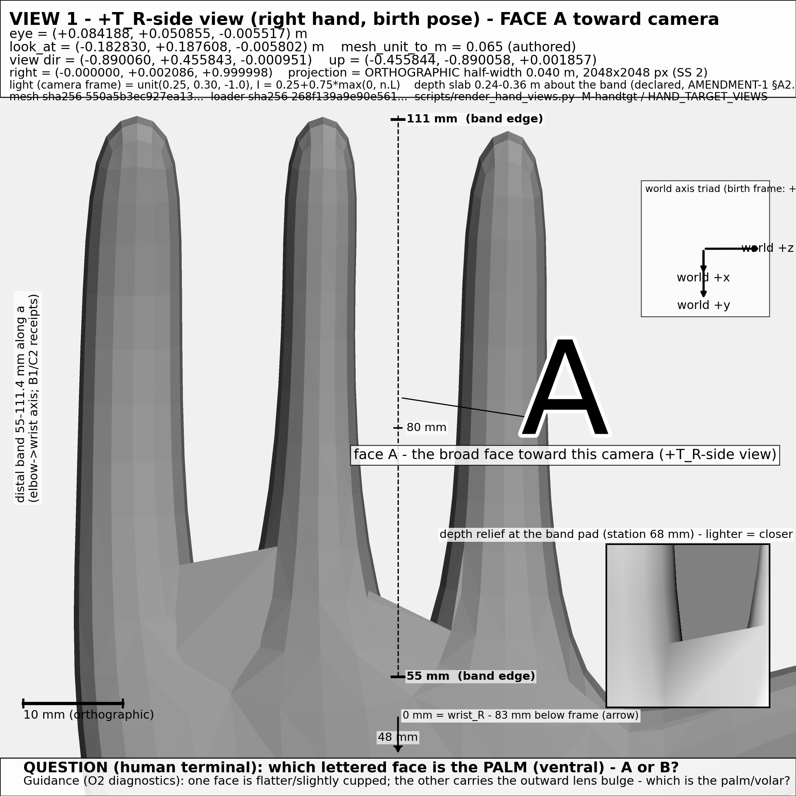
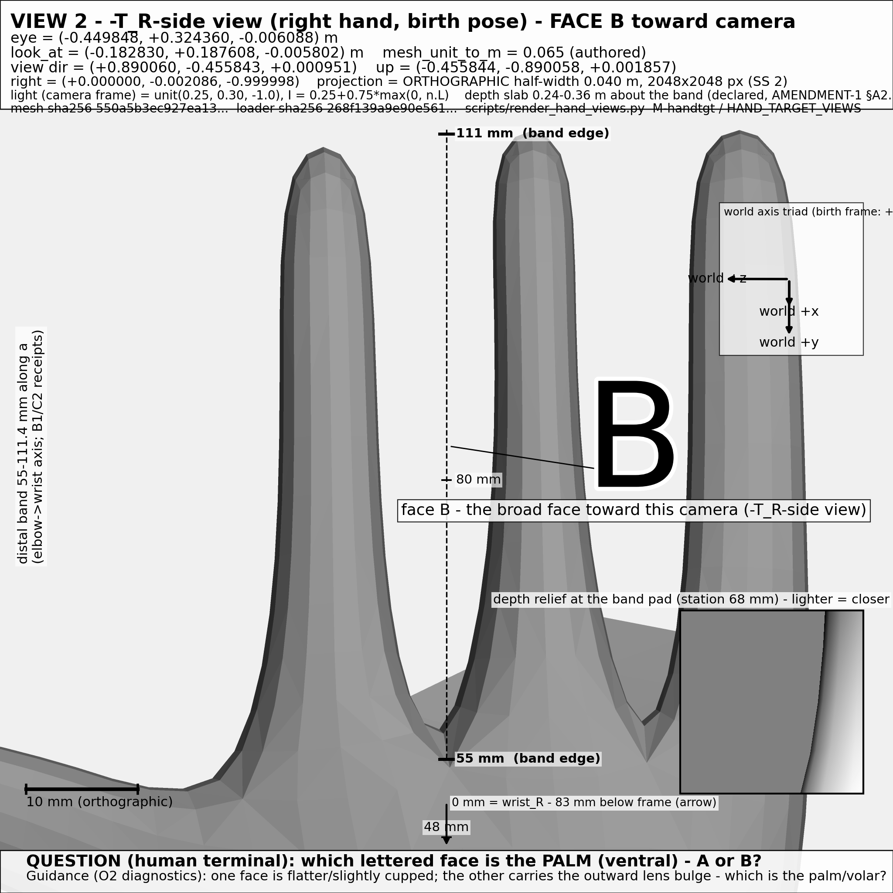

# HUMAN LABELING CARD — which lettered face of the target hand region is the PALM?

**Fulfills:** `audits/HAND_EVIDENCE_REQUEST/HAND_EVIDENCE_REQUEST.md` §R1 (O2's TARGET prong)
**Rendered by:** M-handtgt / HAND_TARGET_VIEWS · CPU-only (matplotlib Agg + numpy z-buffer; no GPU contexts)
**Mesh:** `baseline_snapshot/inputs/monkey_birth.bin` sha256 `550a5b3ec927ea13614ad250963b23e2948e76a238ac110da9889f339aabfa3c` (no repair/resampling) · `mesh_unit_to_m = 0.065` (authored)
**Falsifier that fires if you CANNOT answer:** F-R1a — if both faces are visually indistinguishable to you at this resolution, the assumption "the palm/dorsal distinction is visible in the birth-mesh surface" is REFUTED; record that; the view is not retried with a re-framed camera.
**Scope guard (F-R1c):** if the region reads to you as NON-hand anatomy (limb/tail skin mass), say so — that escalates to §R3 before any palm sign is consumed.

---

## THE QUESTION

> **Which lettered face is the PALM (ventral) — A or B?**

Each image shows ONE broad face of the right hand's distal band (55–111.4 mm along the elbow→wrist axis), photographed face-on by a declared orthographic camera. Face **A** is the broad face on the **+T_R side**; face **B** is the broad face on the **−T_R side** (T_R = (0.890060, −0.455843, 0.000951), C3's fixed +x-rejection rule; the letters label FACES, not anatomy — your answer creates the anatomical sign).

**Guidance (O2's recorded diagnostics, stated on the images):** one broad face is the flatter/slightly cupped one; the other carries the outward lens bulge. State which lettered face is the palm/volar, and name the visible feature your identification rests on.

## THE TWO VIEWS (right hand — the deliverable)

| face | image | camera (declared, orthographic half-width 0.040 m, 2048×2048 px) |
|---|---|---|
| **A** |  | eye = (+0.084188, +0.050855, −0.005517) m · look_at = (−0.182830, +0.187608, −0.005802) m · view dir = (−0.890060, +0.455843, −0.000951) · up = (−0.455844, −0.890058, +0.001857) |
| **B** |  | eye = (−0.449848, +0.324360, −0.006088) m · same look_at · view dir = (+0.890060, −0.455843, +0.000951) · same up |

Birth frame (O1): anterior = +z, up = +y, right = −x. Each image also carries its own title-strip camera declaration, a 10 mm scale bar, the world axis triad, the axial ruler (0/48/55/80/111 mm stations; 0 mm = wrist_R, off-frame by the frozen camera), and a depth-relief inset of the band pad.

## CONSISTENCY CHECK (optional, for your confidence)

`figures/hand_target_L_mirror_check.png` shows the LEFT hand with letters assigned by the exact mirror relation (A_L mirrors R's face A; note the mesh is only ~88–91 % x-mirror-exact, so this is a visual, not pixel-exact, check). If you identify the palm here, state whether the SAME letter is palm on the left as on the right.

(Record-only artifacts, not part of the question: `hand_target_R_view1_literal_nt_record.png` / `..._view2...` — the literal R1.4 ±n_t cameras, near edge-on, 567 px band span < the 600 px visibility bar; kept as the frozen-prereg execution record per PREREG_AMENDMENT_1.)

## WHAT EACH ANSWER CLOSES (O2's target prong)

- **"A is the palm"** → palm face = the +T_R-side broad face; the palm/dorsum SIGN of the target paddle is DECIDED in the birth frame. O2 criterion "one visual identification of the paddle's palm face in a KNOWN birth-pose/camera frame" is met; the target end of the hand roll SIGN mapping becomes stateable.
- **"B is the palm"** → same closure with the opposite sign; the 180° flip C3 left open ("line determined; sign undetermined") is resolved the other way.
- **"Cannot decide (faces indistinguishable)"** → F-R1a FIRES: the visibility assumption is refuted at this asset resolution; O2's lens/flat reading stands as the visual truth; the blocker survives, recorded, not retried.
- Any answer also records what it does NOT close: dimensions, same-assembly (§R3), digit structure, and force capacity stay exactly as they were.

## ANSWER (to be authored by the HUMAN terminal — operator, or operator-designated vision judgment endorsed by the operator; a bare model answer is another claim, not a verdict)

```
Answer (circle/keep one):        A is the palm  /  B is the palm  /  CANNOT DECIDE (F-R1a)
Visible feature the identification rests on:
Reader (identity + role):
Date:
Left-hand consistency (optional): same letter is palm on L?  yes / no / n-a
Region reads as hand anatomy? (F-R1c):  yes / no - escalate R3 / unsure
```

---

*Artifact hashes at issue (sha256, full table in `receipts/hashes_run2.txt`): view 1 `a05bc5f91912c575…`, view 2 `2c89036dde88cf0f…`, mirror check `23450745dc79cf7d…`. Both deliverable PNGs reproduced byte-identically across two unmodified runs of `scripts/render_hand_views.py` (receipts/run1.log, run2.log).*
