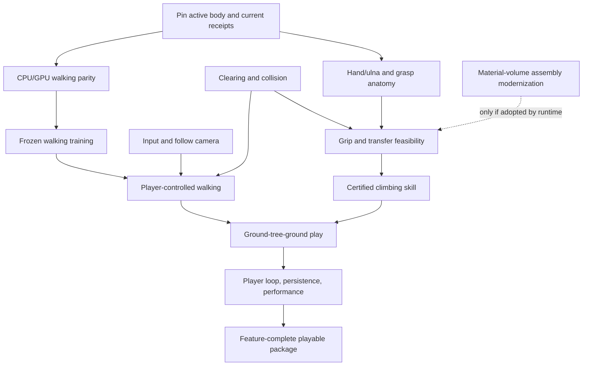

# Chimera: playable monkey completion map

**Planning handoff, 2026-09-24.** Scope selected by the operator: playable monkey game first; broader Chimera vision stays in the later backlog.

This map contains **83 work items**, **28 calculation/contract families**, and **10 deferred feature families**. These are finite capability-level tasks, not an assertion that every future bug or implementation subtask is already known.

## What already exists

- [The Living Holodeck Blueprint](E:/PythonChimera/docs/THE_HOLODECK_BLUEPRINT.md) and [its catalogue](E:/PythonChimera/docs/roadmap/holodeck_tasks.json) contain 240 cards across 40 domains. The inspected catalogue says `REVIEW_DRAFT_NOT_INSTALLED`; all 240 cards say `PROPOSED`. Its structural validator passed; that validates the catalogue, not the game.

- [The Master List](E:/PythonChimera/docs/THE_MASTER_LIST.md) points to that catalogue as a design annex. Its top control snapshot predates the current monkey goal. Do not treat that snapshot as a current agent roster.

- The configured Graphify file is `E:/PythonChimera/Chimera/docs/chimera_knowledge_graph.json`: 4,958 nodes and 5,437 edges. The DNA JSON snapshot has 3,970 nodes and 1,874 edges. No exact existing catalogue IDs were found in inspected nodes' `id/task_id/catalog_id/name/label` fields. This does not rule out indirect prose references or newer records in another store.

- The default DNA backend is SQLite. Opening the local `dna.db` read-only failed, so its current contents were not verified. Graphify is not exposed as a callable connector in this session; on-disk configuration, code and snapshots were inspected instead.

- The old `E:/Chimera/Docs/Architecture/creature-v1` roadmap is explicitly superseded. It must not become a second task authority.

## The finish line

The player launches a small forest game, controls one physical monkey walking on all fours, steers and stops, approaches one rigid tree, requests a climb, ascends, holds, descends, releases and resumes walking. Motion is produced through the approved physical actuation and learned skills. Failures remain physical and the player has an explicit way to continue.

Core locomotion/climbing is confirmed scope. A usable camera and command mapping are necessary implementation. Start/pause/restart/settings, a repeatable objective or free-play definition, selected teaching/inspection, sound and a distributable package are recommended requirements for a complete small game rather than just a movement demonstration; their exact acceptance boundaries remain product decisions.

P06 must freeze supported hardware, input devices, terrain/trunk ranges, session length, latency and frame-time limits before release tests. No arbitrary new physical thresholds, training objectives, model laws, anatomical mappings or supersessions are authorized by this planning file.

## Critical dependency structure

The assembly/compiler branch must not become an invented prerequisite for the already-authorized walk. First establish which body and asset lineage the playable build actually uses. The forearm/paddle packet and CT macaque are not automatically interchangeable. The 6.15 kg animal and 17.04 kg transported source claims must not be reconciled by forcing numbers to agree.

## Current facts that affect the map

- **Walking:** the last user-supplied critical-path report still named the tick-3 event and transcendental residuals. Training was authorized after frozen gates, but completion has not been established in this review.

- **Anatomy:** U-ANA is rejected in the current campaign. U-STR is provisional. Hand same-assembly correspondence and digit structure remain blocked under the existing assets/contract. No radius supersession or new fitting candidate is authorized. Candidate C remains failed at 67.147 micrometres per side; four wrist sites are outside under both tested loops.

- **Newer Buffy disk report:** [assembly_handoff_02.md](E:/PythonChimera/agent_logs/local_buffy_qwen/assembly_handoff_02.md) reports input producers and nine ownership bindings. It still reports `dynamics_trial_ready=false`, eight unqualified ports, no real material-volume input, and four disconnected referenced roots: pelvis, thorax, ulna, ulna_l. Its cannot-produce reports are evidence of gaps, not completed required inputs. This report was read, not independently rerun.

- **Exporter:** author-side static tests and a v1 static consumption contract are reported. Independent verification remained open in the last conversation receipt. No runtime consumption or readiness promotion is implied.

- **Previously delivered:** connected CT rendering, save/restore, certificates, lessons, network and lifecycle facilities have reported receipts. Reuse them. Only changed scopes or contradictory evidence justify reopening them.

## Work-item register

Every task currently has `UNRECONCILED` implementation state and `NOT_REVERIFIED_IN_THIS_REVIEW` validation state in the JSON. That means this planning review has not matched it to current live evidence; it does not mean the feature is absent. The observations distinguish reported progress from open requirements. Dependencies refer to final completion/acceptance; independent preparation can proceed sooner.

Scopes: **core** = confirmed milestone/enabling work; **recommended_product** = proposed complete-game/release requirements to select; **conditional** = only mandatory if the chosen build consumes that subsystem. No scope grants a new architecture change.

### Scope, identity, and fleet (core)

Existing catalogue crosswalk: GOV-01, GOV-02, GOV-04, GOV-05, SYS-03.

| ID | Deliverable | Prerequisites | Calculations | Done when | Current evidence / limit |
|---|---|---|---|---|---|
| P01 | Freeze the playable-monkey completion contract | None | — | One monkey, ground movement, one climbable trunk, return to ground, explicit success/failure behavior; broader features excluded | Operator selected playable monkey first on 2026-09-24 |
| P02 | Pin the active monkey and scene lineage | P01 | C01 | CT monkey, source musculoskeletal model, older forearm/paddle assets, training body, and runtime body are related explicitly or kept separate | Reports involve different assets and mass claims; compatibility is not established by their shared name |
| P03 | Reconcile current work and receipts into existing ledger | P01 | — | Every active task has one owner, source revision, scoped verdict, and receipt; prior completed work is reused | Conversation receipts are newer than the broad catalogue |
| P04 | Apply fleet resource and gaming contract | P03 | C27 | Every launched job uses existing ownership/broker rules; admitted training may interrupt gaming and local inference through a verified supervisor handoff, while already-running protected training retains ownership until confirmed release | Supervisor reported 8/8 passing; broker completion needs current receipt |
| P05 | Retain milestone recovery and artifact identity | P03 | — | Recoverable commits, run manifests, training checkpoints, raw/blob/canonical hash labels, and retry rules exist | Commit recovery and runtime certificates reported; reuse them |
| P06 | Choose release acceptance limits | P01 | C27, C28 | Supported hardware, controls, terrain/trunk envelope, session duration, latency, frame-time and stability limits are frozen before acceptance trials | No numeric product-wide limits supplied; do not fabricate them |

### Walking foundation (core)

Existing catalogue crosswalk: GPU-03, GPU-05, CTRL-01, CTRL-02, CTRL-06, VERIFY-06.

| ID | Deliverable | Prerequisites | Calculations | Done when | Current evidence / limit |
|---|---|---|---|---|---|
| W01 | Close tick-3 discrete forelimb parity defect | P02, P03 | C09 | Frozen entry-state and event traces satisfy the existing CPU/GPU acceptance bar | Last user status: residual open; reconcile newer receipts |
| W02 | Close transcendental parity defects | P02, P03 | C09 | Reference-math equivalence is demonstrated at the frozen sites without tolerance relaxation | 31/125 sites reported; fdlibm equivalence must not be assumed |
| W03 | Integrate frozen parity and walk anchors | W01, W02 | C09 | Freefall/stand/C1/C2 and scene f6844ee, stdout 8c537cdb, 302 ticks, 30.970714 J reproduce on the training revision | Frozen acceptance anchors supplied by operator |
| W04 | Bind training manifest and compatibility certificate | W03 | C10, C05, C06, C07, C08 | Exact dynamics, observations/actions, model revision, seeds and runbook identity are frozen and checked | Certificate system and observation-aliasing fix reported complete |
| W05 | Execute unchanged authorized walking runbook | W04, P04 | C10 | All three prescribed seeds execute under the frozen approximately 1M-decision runbook with failures retained | Training authorized conditionally; no reported completed run |
| W06 | Evaluate trained walking outcomes | W05 | C10, C11 | Frozen walking success/failure metrics reported per seed without cherry-picking or additional tuned runs | Use existing runbook; a failed result is not an implementation success |
| W07 | Load accepted walking policy in native runtime | W06 | C10, C11 | Runtime consumes the certified observation/action contract and drives physical actuators | No pose-writing locomotion substitute |
| W08 | Verify commanded start, stop, speed, and heading | W07 | C11, C12 | Frozen command sequence satisfies tracking and physical-stability limits | Existing 20 Hz speed/heading seam is retained |
| W09 | Implement explicit out-of-envelope behavior | W07 | C13 | Unsupported states and falls have a declared controller response; no concealed resets or forces | Recovery skill is optional unless required by the chosen product contract |
| W10 | Accept walking in the actual game scene | W08, W09, F04, U02 | — | Player can walk, turn and stop in the scene on a supported surface; numerical and visual receipts match | Walking demo is a product milestone before climbing |

### Player controls and camera (core)

Existing catalogue crosswalk: PLAT-01, AUTH-04, AUTH-06, LGT-04.

| ID | Deliverable | Prerequisites | Calculations | Done when | Current evidence / limit |
|---|---|---|---|---|---|
| U01 | Map gameplay input to the existing command seam | P01, P03 | C12 | Input emits bounded speed/heading commands at the existing 20 Hz boundary, without state teleportation | Do not require retraining for a UI remapping |
| U02 | Deliver a usable follow camera | P01, P03 | C23 | Player can see motion on ground and at trunk; camera avoids tested obstruction cases and never moves the animal | Independent of unfinished walking training; may test with existing scene |
| U03 | Handle focus loss and input release | U01 | C12 | Alt-tab, disconnect and key release clear or age commands under a declared policy; no stuck movement | Keep operator desktop focus and processes untouched |
| U04 | Expose supported input settings | U01 | — | Sensitivity, inversion and bindings needed for the selected controls work and persist | Keyboard/mouse baseline; controller support is an explicit product decision |
| U05 | Define and implement climb intent seam | U01 | C12 | One explicit climb/let-go intent reaches the skill selector with versioned semantics; frozen walk contract remains unchanged | Requires a reviewed interface decision, not an invented API |
| U06 | Add readable control and state feedback | U05 | — | Prompts distinguish available climb, unavailable support, holding, falling and recovery without claiming nonexistent capabilities | Minimal player language; engineering diagnostics stay optional |
| U07 | Measure controls during actual play | W10, U03, U04 | C12, C23 | End-to-end input response and camera behavior meet P06 limits under repeatable scenes | Human feel and measured latency are distinct acceptance fields |

### Small forest environment (core)

Existing catalogue crosswalk: ENV-01, CON-01, CON-02, PROC-01, SYS-03, LGT-04.

| ID | Deliverable | Prerequisites | Calculations | Done when | Current evidence / limit |
|---|---|---|---|---|---|
| F01 | Author the finite clearing and its spatial units | P01 | C01 | Deterministic terrain/tree recipe, explicit extent and coordinate convention, safe spawn and visible boundary | One clearing is sufficient; no planet or infinite-world requirement |
| F02 | Build matching terrain rendering and collision | F01 | C14 | Rendered ground and physical query surfaces agree within frozen geometric tolerance | Reuse engine geometry/collision paths |
| F03 | Implement one rigid climbable trunk asset | F01 | C15 | Trunk geometry, surface IDs, material provenance and collision representation are explicit | Deformable branches and bark damage deferred |
| F04 | Verify ground and trunk contact geometry | F02, F03 | C08, C14, C15 | No unacceptable tunnelling, ghost support, interpenetration or visual/collision disagreement in frozen cases | Only claimed collision capabilities must be demonstrated |
| F05 | Specify the terrain range for walking | F02, W06 | C14 | Slope, obstacle size and surface-friction envelope is declared from evidence | Do not assume flat-ground training transfers to arbitrary terrain |
| F06 | Implement and qualify terrain-aware walking | F05, W07 | C11, C14 | Player walks the declared uneven-ground cases with certified runtime/training agreement | Any expanded training objective gets a new approved runbook |
| F07 | Place forest obstacles and scene boundaries | F04 | C14, C23 | The clearing offers traversable routes; no invisible walls masquerade as physical obstacles | Player steering needs no general autonomous pathfinding |
| F08 | Verify repeatable forest loading | F07 | — | Scene seed/configuration reproduces assets, collision and initial state with clear failures for missing assets | Resource cleanup uses existing lifecycle machinery |

### Anatomy and grasp prerequisites (core)

Existing catalogue crosswalk: CTRL-01, BIO-02, MAT-03, PROC-02.

| ID | Deliverable | Prerequisites | Calculations | Done when | Current evidence / limit |
|---|---|---|---|---|---|
| A01 | Resolve ulna volar-side orientation evidence | P02 | C01, C16 | Independent anatomical evidence determines roll sign or records ambiguity | Authorized diagnostic measurement; not a production mapping |
| A02 | Validate U-STR and proposed radius consequence | A01 | C01, C16 | Radioulnar definition, independent evidence, B4 result and before/after radius mapping are presented | U-ANA rejected; U-STR provisional; radius supersession not authorized |
| A03 | Approve and implement supported ulna correspondence | A02 | C01, C16 | Architect approves mapping/supersession, historical radius preserved, new transforms and regressions qualified | Do not select mapping for favorable moment arms |
| A04 | Determine hand assembly identity and palm orientation | P02 | C01, C16 | Source and target assembly correspondence is evidenced, including palm sign and geometry coverage | H-LEN/H-ASP unresolved; H-BODY circular; orientation alone does not set scale |
| A05 | Acquire or author evidenced hand/digit structure | A04 | C16 | The modeled grasp has sufficient explicit bodies, joints and geometry; sources and adaptations approved | Existing asset/contract cannot map digits; no arbitrary deformation or hidden grip |
| A06 | Resolve attachment and waypoint ownership | A03, A05 | C17 | Every grasp-relevant endpoint and waypoint has an explicit approved body and role | Do not reinterpret waypoints as attachment ports |
| A07 | Resolve failed/outside attachment placements lawfully | A06 | C17 | Attachment validity is supported or explicitly unresolved; any new fitting experiment is separately authorized | Candidate C remains failed at 67.147 micrometres per side; four wrist sites outside under both loops |
| A08 | Define evidenced muscle/tendon parameter envelope | A06 | C07, C18 | Strength, force-length/velocity, compliance, limits and applicability are defined for the selected animal | Do not inherit unrelated human or differently scaled masses/strengths |
| A09 | Issue the grasp anatomy input package | A07, A08 | C01, C17, C18, C05, C06 | One versioned package carries supported mappings, parameters, provenance and explicit gaps | Anatomy completion does not itself prove climbing |

### Grasp and climbing mechanics (core)

Existing catalogue crosswalk: CTRL-03, CTRL-04, BIO-02, CON-03, CON-04, DYN-02.

| ID | Deliverable | Prerequisites | Calculations | Done when | Current evidence / limit |
|---|---|---|---|---|---|
| G01 | Derive support and grip feasibility | A09, F03 | C19, C20 | Required force/moment support lies within reachable contacts and actuator bounds for the declared trunk | Static support is necessary, not proof of climbing |
| G02 | Qualify finite-area anatomical attachments | A09 | C17 | Actual patch geometry, stiffness and rotational resistance meet declared physical requirements | Synthetic lambda_min=32 result cannot qualify real ports |
| G03 | Evaluate tendon lengths and moment arms | A09 | C18 | Relevant pose-range outputs are finite and independently checked; unresolved bodies cannot appear as zero arms | Only BRD paths functional in last forearm report; reconcile new evidence |
| G04 | Implement and verify physical grip contact | G01, G02, G03, F04 | C08, C19 | Attachment, friction, reaction loads and release operate through the physical solver without invisible anchors | Model choice stays inside approved architecture |
| G05 | Implement contact/support observations | G04 | C21 | Controller receives only declared measurable contact/pose signals with explicit timing | No hidden simulator information represented as sensed information |
| G06 | Prove a supported limb-transfer sequence | G04, G05 | C16, C20 | At least one reachable transfer retains admissible support throughout its tested envelope | Static whole-body equilibrium alone is insufficient |
| G07 | Measure unsupported release and falls | G04 | C13, C20 | Loss/release of support removes its forces and yields accounted motion and energy | Preserve failures; no reset or leftover constraint concealing loss of support |
| G08 | Qualify climbing dynamics and numerical budget | G06, G07 | C09, C20, C05, C06 | Accepted mechanics pass CPU/GPU and runtime identity gates relevant to climbing | Do not inherit walking certification for changed hand/contact dynamics |

### Climbing skills (core)

Existing catalogue crosswalk: CTRL-04, CTRL-06, VERIFY-01, VERIFY-06.

| ID | Deliverable | Prerequisites | Calculations | Done when | Current evidence / limit |
|---|---|---|---|---|---|
| K01 | Freeze the climbing skill specification | G08, U05 | C10, C21 | Observations, actions, reward, termination, success metrics, seeds, envelope and falsifiers approved before training | First skill family: attach, ascend, hold, descend, release |
| K02 | Build reproducible climbing reset scenarios | K01 | C10, C21 | Initial states are valid and attributable; setup/reset never becomes a hidden in-episode assist | Use one rigid trunk first |
| K03 | Train climbing under approved reservations | K02, P04 | C10, C21 | Approved runs finish or fail with checkpoints and unchanged acceptance criteria | No seed substitutions or success-driven reruns |
| K04 | Evaluate climb, hold and descend separately | K03 | C20, C21 | Each claimed behavior meets frozen metrics; failures and unsupported cases are visible | An ascent success cannot stand in for controlled descent |
| K05 | Integrate the accepted climbing policy | K04 | C10, C21 | Native policy consumes certified dynamics and commands only available actuators | Keep trained and shipped dynamics identical within the defined certificate |
| K06 | Implement walk/climb skill arbitration | K05, W07, U05 | C22 | Transition preconditions, cancellation, ownership and command handling are explicit | No automatic snap-to-tree |
| K07 | Verify boundary and failure behavior | K06 | C13, C22 | Out-of-reach, rejected grip, excessive load and lost contact terminate/transition according to the specification | Do not expand the declared skill envelope to hide failures |
| K08 | Accept the complete ground-tree-ground loop | K07, F06, U07 | C22 | Player approaches, attaches, ascends, holds, descends, releases and resumes all-fours walking in one session | This is the core playable-monkey milestone |

### Player experience and complete game loop (recommended_product)

Existing catalogue crosswalk: AUTH-04, AUTH-06, LGT-01, SND-05, SOC-05.

| ID | Deliverable | Prerequisites | Calculations | Done when | Current evidence / limit |
|---|---|---|---|---|---|
| X01 | Define the small game's repeatable objective | P01 | — | A finite purpose/lesson/free-play completion definition is selected without inventing a campaign | Movement demo versus complete game needs this explicit product choice |
| X02 | Implement start, pause and session restart flow | P01 | — | Player reaches play and can pause/restart/exit without developer commands; reset is an explicit user action | Proposed minimal product requirement |
| X03 | Implement the chosen fall/recovery experience | W09, X02 | C13 | The player can continue after failure by the approved recovery action or visible restart | Do not require a new get-up skill unless explicitly selected |
| X04 | Render readable animal and environment state | W10, F08 | — | Connected animal, contact and climbing states are readable in actual captures with no second locomotion pose | Connected CT rendering reported; reuse and check affected paths |
| X05 | Add grounded interaction audio | G04, W10 | C24 | Contact/release/impact cues follow actual events, have volume controls and honest material scope | Procedural acoustic simulation is not automatically required |
| X06 | Wire physics teaching/inspection to live values | X01, K08 | C25 | Selected lesson or inspector uses runtime quantities with units and explains declared limitations | Commercial teaching-game intent retained; Lesson One previously reported |
| X07 | Run the stranger playthrough and human acceptance | K08, X01, X02, X03, X04, U06 | C12, C28 | A player can discover controls, complete the loop and understand failure without operator coaching | Prior scripted action at 0.91 s is evidence for that old slice only |

### Persistence, performance, and reliability (core)

Existing catalogue crosswalk: SYS-02, SYS-05, GPU-06, SHIP-02, SHIP-03, SHIP-04.

| ID | Deliverable | Prerequisites | Calculations | Done when | Current evidence / limit |
|---|---|---|---|---|---|
| R01 | Extend save/restore to the complete playable state | K06 | C26 | Pose, velocity, policy/actuator/contact state, scene, RNG and clocks resume under the existing continuation contract | Fresh-process bit-identical restoration reported for prior state; additions need coverage |
| R02 | Implement player settings and save lifecycle | R01, U04, X02 | — | Save selection/version refusal and interrupted-write behavior are explicit; settings persist | Schema migration only when an actual supported prior save requires it |
| R03 | Profile representative ground/climb scenes | K08, P06 | C27 | Frame-time distribution, simulation-step time, memory, VRAM and stalls measured in reserved windows | Contended timing measurements are invalid |
| R04 | Fix measured runtime bottlenecks | R03 | C27 | Target acceptance budgets met with unchanged physical/behavioral gates | FK previously reported 87.9% CPU tick; reprofile current workload before optimizing |
| R05 | Verify long sessions and resource teardown | R04, X02 | C27 | Repeated scene/restart/save cycles stay inside limits and all owned children/resources close | No leaks accepted merely because RAM is plentiful |
| R06 | Exercise input/device/failure recovery | R02, R05 | — | Focus changes and claimed device-loss/suspend behaviors fail or recover clearly without corrupting saves | Only certify supported platforms and cases actually exercised |
| R07 | Bind full release compatibility evidence | R06 | C09, C10, C26 | Code/data/policy/configuration identity matches the accepted complete game and independent receipts | No stale certificate inherits through an untracked dynamics change |

### Release and feature-complete acceptance (recommended_product)

Existing catalogue crosswalk: PLAT-05, TRUST-05, SHIP-01, SHIP-06.

| ID | Deliverable | Prerequisites | Calculations | Done when | Current evidence / limit |
|---|---|---|---|---|---|
| S01 | Audit distribution provenance and dependencies | P02 | — | Every shipped asset/model/library has a recorded source and applicable distribution terms | Existing license receipts are inputs, not blanket clearance for future assets |
| S02 | Build a self-contained Windows package | R07, S01, X02 | — | Clean machine/user can launch without repo paths, development Python or operator-installed tools beyond declared dependencies | Existing demo packager reported in integration queue; reconcile it |
| S03 | Verify install, launch, save and clean exit | S02 | — | Package passes the declared supported Windows/hardware smoke and lifecycle cases | Developer machine success alone is insufficient |
| S04 | Complete player help and failure diagnostics | S02, X07 | — | Controls, supported limits, crash/report path and recoverable errors are understandable | Do not surface implementation trivia in the player flow |
| S05 | Accept playable-monkey feature completion | S03, S04, X05, X06, R07 | — | All selected core/product behaviors pass; remaining issues are triaged explicitly; operator accepts actual play | Not a claim that all 240 Chimera capabilities are complete |
| S06 | Prepare public/demo release assets | S05 | — | Approved build, concise controls, captures and release notes are packaged; publication follows operator authorization | Website and marketing remain after playability |

### Material-volume and assembly modernization (conditional)

Existing catalogue crosswalk: DYN-01, PROC-04, PROC-06, MAT-03, VERIFY-01.

| ID | Deliverable | Prerequisites | Calculations | Done when | Current evidence / limit |
|---|---|---|---|---|---|
| B01 | Close independent exporter review and multi-cell coupon | P03 | C02, C03, C04 | Actual independent review targets 1af0bbde; U1 has frozen analytic evidence; hash claims remain distinct | Author-side proofs reported; independent review still open in last pasted receipt |
| B02 | Complete supported static exporter coverage | B01 | C02, C03, C04 | Authorized scale/transform/status/numerical tests and static diagnostics ship with distinct evidence classes | Do not make every possible coupon a release gate |
| B03 | Produce real validated material-volume input | P02 | C02, C03 | Actual geometry, material ownership and density source support a complete input for the selected body | Buffy 02: bbox scale/origin/basis do not supply volume or density |
| B04 | Author the real assembly frame forest explicitly | P02 | C01 | pelvis/thorax/ulna roots and transforms are authored with evidence; no guessed alignment | Buffy 02 reports four disconnected referenced roots; prepared definition is not authorization |
| B05 | Provide real mechanical port requirements | B04 | C17 | Actual port patch/stiffness/couple/weight/frame inputs qualify or remain blocked | Eight ports missing parameters; source tendon points are insufficient |
| B06 | Re-run real assembly readiness without substitutions | B03, B04, B05, B02 | C02, C17 | All mass/ownership/frame/port requirements evaluated, with remaining gaps explicit | Buffy 02 binds 9 claims but 17.039978509953905 kg stays transported/not counted; readiness false |
| B07 | Decide and qualify adoption by walking/climbing runtime | B06 | C09, C10 | Architect names why this assembly replaces the current body, then requalifies affected dynamics/policies before use | Conditional branch: do not block existing certified walking merely because a separate compiler packet is incomplete |

## Calculation and physical-contract register

These are the things that must be calculated, specified, or measured for the chosen game. Some already exist and should be referenced, not recalculated. The expressions below identify the calculation family; they are not substitutes for a task-specific derivation or a claim that the relevant law has passed.

| ID | Calculation / contract | Required inputs | Method | Required result | Check |
|---|---|---|---|---|---|
| C01 | Frames, units and source correspondence | Source/target axes, landmarks, units, scale, transform conventions | x_world=R x_local+t for rigid frames; distinguish scaling from rotations; compose/invert explicitly | One unambiguous frame chain and independently checked transforms | Round-trip, handedness, landmark and independent-orientation checks |
| C02 | Mass inventory | Disjoint occupied material volumes, density with conditions, ownership | m=integral rho dV; surface mass only if explicitly represented and not already volume-owned | Mass per body and counted total with excluded claims | Analytic cells, disjoint ownership, shared-interface and recombination controls |
| C03 | Centre of mass and inertia | Geometry, rho, mass, authored frame | c=(integral rho x dV)/m; I_c=integral rho[(r dot r)Id-r r^T]dV | Full symmetric inertia about COM including off-diagonals | Independent quadrature, rotation covariance and parallel-axis recombination |
| C04 | Scaling and numerical conditioning | Geometric scale, density policy, dimensions, precision | Uniform length scaling s gives m proportional to s^3 and inertia to s^5 only at unchanged density; handle anisotropic scaling by integration | Correct units/scales and justified numeric error budget | Non-unit fixtures, adverse scales and independent transformed integrals |
| C05 | Joint kinematics and feasible motion | Joint axes, attachment frames, limits, chain topology | Forward kinematics and body/contact Jacobians with explicit conventions | Reachable poses and correctly placed joints | Independent landmark/closure and finite-difference checks |
| C06 | Articulated dynamics and force accounting | Mass/inertia, joints, external/contact/actuator loads | M(q) qddot + h(q,qdot)=tau+J^T f under the chosen model | Accelerations and equal/opposite reactions | Known-answer dynamics, momentum/work ledgers and interventions |
| C07 | Actuator limits and passive response | Selected animal parameters, ROM, force-length/velocity, compliance, damping | Evaluate the approved muscle/passive model inside its applicability range | Physical action limits; no human-norm torque substituted for this animal | Independent parameter provenance and saturated/obstructed-motion controls |
| C08 | Contact and collision | Shapes, timestep, friction data, contact solver | Nonpenetration and unilateral normal contact; friction tangential bound under the chosen contact law | Stable support, slip, release and collision events | Impact/sliding/resting controls, reaction accounting and tunnelling cases |
| C09 | CPU/GPU parity and time stepping | Frozen entry states, operation order, precision, event rules | Match the declared reference and frozen bars; derive numerical budgets per operation where applicable | Certified dynamics/event behavior for each claimed backend | Frozen freefall/stand/C1/C2, event localization, reference-math checks and mutation controls |
| C10 | Training/runtime identity and learned-skill evaluation | Dynamics/policy manifests, observation/action contract, seeds, approved metrics | Use the frozen runbook; separate train/evaluation cases and bind all dynamics-relevant state | Reproducible policies and scoped success/failure outcomes | Per-seed receipts, certificate mismatch rejection and held-out checks required by runbook |
| C11 | Walking tracking and stability | 20 Hz commands, root motion, contact/support state | Measure commanded versus achieved speed/heading and declared physical stability metrics | Walking envelope, stopping/turning behavior and failures | Frozen command sequences in actual runtime without pose bypass |
| C12 | Input timing and control mapping | Input timestamps, sampling, command expiry and scene events | 20 Hz implies a 50 ms command interval, not an end-to-end latency guarantee | Measured response latency and consistent command semantics | Timestamp chain, release/focus/disconnect and actual-play checks |
| C13 | Falls, energy and recovery | Potential/kinetic energy, actuator work, contacts and dissipation | Account delta stored energy against work, losses and external support under the declared model | Lawful falls and explicit post-failure behavior | Release/impact traces; no residual support, teleport or hidden reset |
| C14 | Terrain and traversability | Height/mesh field, normals, slope, obstacles, friction, reachable foot placement | Compute geometry and gradient/normal consistently with physical collision representation | Supported terrain envelope and routes | Render/query agreement and frozen slope/obstacle cases |
| C15 | Trunk geometry and surface contract | Radius/profile, collision mesh, material/friction source, surface identity | Evaluate explicit rigid geometry and contact normals; quantify representation error | A repeatable supported trunk configuration | Contact versus render checks, reachable approach and geometry bounds |
| C16 | Grasp reach and anatomical correspondence | Joint topology, ROM, hand geometry, independent landmarks | FK/Jacobians plus independent anatomical correspondence; geometry feasibility precedes skill training | Reachable grasp placements with valid identities | Independent landmarks; held-out correspondence checks; no utility-based selection |
| C17 | Finite attachment mechanics | Patch area/shape, areal stiffness, couple resistance, weights, frame | Derive attachment stiffness and rotational resistance using the approved finite-area formulation | Actual anatomical port qualification | Analytic/independent checks and real-parameter bounds; synthetic lambda_min does not transfer |
| C18 | Tendon routing and moment arms | Owned endpoints/waypoints, joint positions, wrapping model if supported | Length l(q), signed moment arm r_j=-partial l/partial q_j under declared convention; torque contribution r_j F | Finite, physically attributed tendon forces and joint torques | Finite differences/virtual work and unresolved-owner rejection |
| C19 | Grip contact wrench capacity | Friction coefficient, contact locations/normals, reachable normal forces | sum f + mg = 0 and sum r cross f + external moments = 0 for static support; tangential force limited by contact law | Whether the animal can hold the selected trunk at all | Independent feasible/infeasible support cases within actuator bounds |
| C20 | Vertical transfer and climbing load | Support sequence, body inertia, forces, transfer trajectory, work | Dynamic force/moment balance during each transfer; ascent needs potential-energy change plus losses | Feasible ascent/hold/descent envelope and load limits | Static versus dynamic tests separated; release and missed-grasp controls |
| C21 | Climbing policy observations and task definition | Reach/contact measurements, commands, timing, skill objective | Define observable state and action limits; test aliasing and hidden-state dependence before training | An approved learnable skill contract | Frozen train/eval specification and independent failure cases |
| C22 | Skill transitions and state continuity | Walking/climbing states, contacts, commands, policy memory | Guarded state machine preserves pose, velocity, physical ownership and force continuity within declared allowances | Continuous ground-tree-ground movement | No snap/teleport, unaccounted impulse, stale grip or lost command at transitions |
| C23 | Camera geometry and presentation latency | Camera target, obstacle geometry, input, projection | Visibility/occlusion geometry and response timing; camera may move without applying body forces | Usable ground/trunk view | Occlusion/camera collision cases and human acceptance; no body repositioning |
| C24 | Interaction sound timing | Actual contact/impact/release events and listener pose | Use event timing and declared material/impact mapping; detailed acoustics only if claimed | Consistent audible state feedback | Missing/duplicate event and synchronization checks |
| C25 | Physics teaching and displayed quantities | Accepted runtime states, units, sample timing, lesson objective | Display measured/derived values from the same simulation state and label model limits | An understandable lesson/inspector without fabricated telemetry | Known-answer lesson cases and player comprehension |
| C26 | Continuation and save state | Full dynamics, policy, contact, RNG, clock and scene state | Serialize the state needed by the existing continuation contract and explicit version identity | Reproducible continuation after fresh-process restore | Checkpoint boundary comparisons and corruption/version refusal |
| C27 | Compute, memory and frame budgets | Actual workload, device, timestep, memory/VRAM, queue and frame timing | Measure distributions in reserved windows; relate work to simulation/render budgets | Admitted workload and supported hardware/performance envelope | Preregistered game frame-time and soak limits; contention invalidates benchmark claims |
| C28 | Player acceptance and feature coverage | Frozen product scope, supported inputs, success/failure behavior | Measure task completion and intervention/latency criteria; taste remains human acceptance | A finite feature-complete verdict distinct from broad Chimera ambition | Stranger playthrough, retained failures and explicit operator acceptance |

## Parallel execution without losing the critical path

The coordinator selects ready work after receipt reconciliation. Suggested capacity is seven implementers, two reviewers, and one integrator, adapted to actual dependencies. A reviewer cannot independently certify their own authored oracle. Ten assignments do not authorize ten builds or GPU jobs.

Independent fronts include walking residual fixes, player controls/camera, clearing/collision, grasp anatomy evidence, authorized compiler work, and reuse of packaging/persistence facilities. Keep integration/file ownership explicit. Do not occupy agents with unrelated coupons while a named playable-feature task is ready.

Each dispatched task needs exact input revisions, owned paths, the relevant calculation record, a preregistered prediction/falsifier, resources and a receipt. Keep numerical/device/runtime/visual/human verdicts separate. No repeated success-seeking seed substitutions or relaxed historical thresholds.

## How this belongs in Graphify

This artifact is a reviewable scope overlay, not an installed graph or replacement ledger. Preserve the existing 240-card catalogue as the wider capability reference. Reconcile these local planning IDs to existing native requirement/work objects before allocating permanent IDs. The catalogue crosswalk is many-to-many and is not a completion verdict.

Use the existing native graph contracts to represent: player feature -> required calculation/model -> implementation task -> evidence, plus prerequisite links between tasks. Keep source/instance/asset identities explicit. Graphify should project those authored records; code extraction must not overwrite requirements, active owners or failed/stale evidence.

Before import, compare the current authoritative ledger/controller and graph, merge duplicate work by meaning, retain original IDs/history, and have the coordinator serialize the change. Preserve directed prerequisite edges and distinct relation types. The planning DAG was checked here, but live graph preservation/import has not been executed.

The resulting view should answer: what blocks walking; what blocks climbing; which calculations lack inputs; which independent tasks are ready; which receipts have become stale; and which player feature the next assignment advances. Completion percentages should use selected feature acceptance, not raw node counts.

## Broader Chimera vision: later backlog

| Feature family | Boundary | Existing catalogue references |
|---|---|---|
| Multiple climbable tree forms and branch traversal | Expand only after the single-trunk loop; requires additional geometry, reach, loads and skill coverage. | CTRL-04, BIO-05 |
| Jumping, swinging, brachiation, get-up and carrying | Separate skills and physical envelopes; not silently required for first walking/climbing slice. | CTRL-02, CTRL-06, BIO-02 |
| More species and creature construction | Additional anatomy, parameter applicability, adaptation and authoring contracts. | BIO-01, PROC-02, PROC-04 |
| Multiplayer and networked persistence | Preserve existing server-authoritative work; no requirement to ship multiplayer in the first local game. | NET-01, NET-02, NET-04, NET-05 |
| Large streamed worlds and ecosystems | Forest expansion, streaming, broader physical LOD and population behaviors. | ENV-01, BIO-06, SCALE-03, SYS-03 |
| Water, weather, thermal and chemical interactions | Activate only for selected player features; no general multiphysics completion prerequisite. | FLU-01, THM-01, CHM-01, ENV-02 |
| Deformable trees, damage, tissue surgery and repair | Additional model/asset/coupling work; rigid trunk is the first supported environment. | BIO-05, SOL-05, SHE-06, MULTI-01 |
| Creator tools, UGC and collaborative authoring | Broader editors and interchange beyond the small game authoring needs. | AUTH-02, PROC-03, NET-06 |
| Space, vehicles, economies and social systems | Historical broad vision retained without competing with monkey completion. | ENV-05, MECH-05, SOC-01, SOC-02 |
| XR, haptics and advanced cognition/quantum research | Later product decisions or research; not part of this finite milestone. | XR-01, XR-04, HUM-06, FRONT-05 |

## Validation and limits of this handoff

- 83 unique planning IDs; all local prerequisites resolve; dependency graph is acyclic; 28 calculation IDs resolve; all crosswalk IDs exist in the inspected 240-card catalogue.

- The existing `python tools/roadmap_query.py validate` returned valid for 240 cards/40 domains. No physical, game, training, GPU or assembly tests were run in this review.

- Source files were read from a working checkout observed at `43b599a7c1f11e789cd414b40d7305b9be05066d`; other agents may advance it. This was not an atomic frozen source capture.

- No project file, live graph, active task, process, runtime endpoint or external service was modified. Files here are handoff artifacts only.

- A finite feature contract can be exhaustively tracked; future discovered defects and research outcomes cannot be enumerated in advance. Split or add tasks when evidence warrants it, retaining the feature they enable.

- No elapsed-time estimate or feature-complete percentage is justified until current receipts and selected recommended requirements are reconciled.

## Files

- `MONKEY_COMPLETION_MAP.md`: human-readable register (this file).

- `monkey_completion_map.json`: typed task/dependency/calculation/crosswalk data for coordinator review.

- `planning_inventory.json`: read-only catalogue and on-disk graph inventory, including the SQLite limitation.
